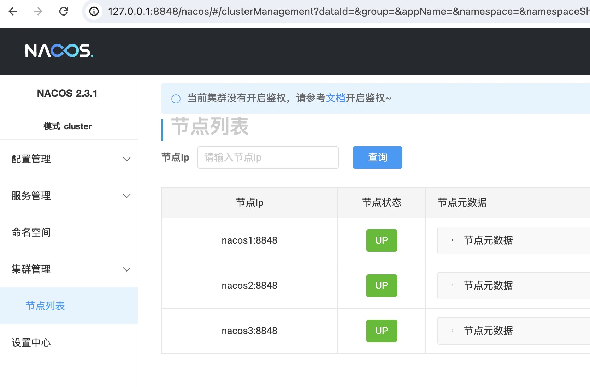

# Docker部署nacos集群

tag：nacos


本文采用docker-compose的形式部署nacos集群，旨在学习、本地开发使用。


1、准备docker-compose.yml，内容如下

```yaml
version: '3.8'
services:
  mysql:
    image: mysql:8.0.37
    container_name: mysql
    hostname: mysql
    environment:
      MYSQL_ROOT_PASSWORD: 123456
      MYSQL_DATABASE: nacos
      MYSQL_USER: nacos
      MYSQL_PASSWORD: nacos
      LANG: C.UTF-8
    ports:
      - "3308:3306"
    volumes:
      - ./data:/var/lib/mysql

  nacos1:
    image: nacos/nacos-server:v2.3.1-slim
    container_name: nacos1
    hostname: nacos1
    environment:
      PREFER_HOST_MODE: hostname
      MODE: cluster
      NACOS_SERVERS: nacos1:8848 nacos2:8848 nacos3:8848
      SPRING_DATASOURCE_PLATFORM: mysql
      MYSQL_SERVICE_HOST: mysql
      MYSQL_SERVICE_DB_NAME: nacos
      MYSQL_SERVICE_PORT: 3306
      MYSQL_SERVICE_USER: nacos
      MYSQL_SERVICE_PASSWORD: nacos
    ports:
      - "8848:8848"
    volumes:
      - ./logs/node-1:/home/nacos/logs

  nacos2:
    image: nacos/nacos-server:v2.3.1-slim
    container_name: nacos2
    hostname: nacos2
    environment:
      PREFER_HOST_MODE: hostname
      MODE: cluster
      NACOS_SERVERS: nacos1:8848 nacos2:8848 nacos3:8848
      SPRING_DATASOURCE_PLATFORM: mysql
      MYSQL_SERVICE_HOST: mysql
      MYSQL_SERVICE_DB_NAME: nacos
      MYSQL_SERVICE_PORT: 3306
      MYSQL_SERVICE_USER: nacos
      MYSQL_SERVICE_PASSWORD: nacos
    ports:
      - "8849:8848"
    volumes:
      - ./logs/node-2:/home/nacos/logs

  nacos3:
    image: nacos/nacos-server:v2.3.1-slim
    container_name: nacos3
    hostname: nacos3
    environment:
      PREFER_HOST_MODE: hostname
      MODE: cluster
      NACOS_SERVERS: nacos1:8848 nacos2:8848 nacos3:8848
      SPRING_DATASOURCE_PLATFORM: mysql
      MYSQL_SERVICE_HOST: mysql
      MYSQL_SERVICE_DB_NAME: nacos
      MYSQL_SERVICE_PORT: 3306
      MYSQL_SERVICE_USER: nacos
      MYSQL_SERVICE_PASSWORD: nacos
    ports:
      - "8850:8848"
    volumes:
      - ./logs/node-3:/home/nacos/logs

```


2、创建docker容器，但不能直接启动。执行如下命令

```bash
docker-compose create
```


3、连接mysql，在nacos数据库执行sql，初始化表结构

[nacos-mysql-init.sql](resource/nacos-mysql.sql)


4、分别启动nacos集群的节点容器


5、校验。进入http://127.0.0.1:8848/nacos，查看 集群管理 -> 节点列表，看到以下内容，则集群节点已正常启动



