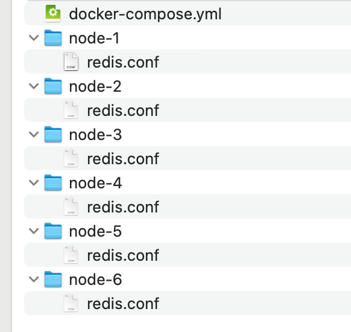

# Docker部署redis集群

tag：redis部署


本文采用docker-compose的形式部署redis集群，旨在学习、本地开发使用。集群共6个节点，3主3从。


1、准备docker-compose.yml，内容如下

```yaml
version: '3.8'

services:
  redis-node-1:
    image: redis:7.2
    command: ["redis-server", "/usr/local/etc/redis/redis.conf"]
    volumes:
      - ./node-1:/usr/local/etc/redis
    ports:
      - "7001:7001"
      - "17001:17001"

  redis-node-2:
    image: redis:7.2
    command: ["redis-server", "/usr/local/etc/redis/redis.conf"]
    volumes:
      - ./node-2:/usr/local/etc/redis
    ports:
      - "7002:7002"
      - "17002:17002"

  redis-node-3:
    image: redis:7.2
    command: ["redis-server", "/usr/local/etc/redis/redis.conf"]
    volumes:
      - ./node-3:/usr/local/etc/redis
    ports:
      - "7003:7003"
      - "17003:17003"

  redis-node-4:
    image: redis:7.2
    command: ["redis-server", "/usr/local/etc/redis/redis.conf"]
    volumes:
      - ./node-4:/usr/local/etc/redis
    ports:
      - "7004:7004"
      - "17004:17004"
            
  redis-node-5:
    image: redis:7.2
    command: ["redis-server", "/usr/local/etc/redis/redis.conf"]
    volumes:
      - ./node-5:/usr/local/etc/redis
    ports:
      - "7005:7005"
      - "17005:17005"

  redis-node-6:
    image: redis:7.2
    command: ["redis-server", "/usr/local/etc/redis/redis.conf"]
    volumes:
      - ./node-6:/usr/local/etc/redis
    ports:
      - "7006:7006"
      - "17006:17006"

```


2、准备好各个节点的redis配置文件，分别放置在docker-compose.yml同路径下的node-1、node-2、node-3、node-4、node-5、node-6目录下，内容如下

- 节点1

  ```
  port 7001
  protected-mode no
  cluster-enabled yes
  cluster-config-file nodes.conf
  cluster-node-timeout 5000
  appendonly yes
  # 向集群其他节点或者客户端宣布的地址，需要保证其他节点或者客户端能够访问
  cluster-announce-ip 172.16.100.47
  cluster-announce-port 7001
  cluster-announce-bus-port 17001
  ```

- 节点2

  ```
  port 7002
  protected-mode no
  cluster-enabled yes
  cluster-config-file nodes.conf
  cluster-node-timeout 5000
  appendonly yes
  cluster-announce-ip 172.16.100.47
  cluster-announce-port 7002
  cluster-announce-bus-port 17002
  ```

- 后续节点以此类推，仅调整端口号即可

整个目录文件如下




3、创建docker容器。执行如下命令

```bash
docker-compose up -d
```


4、集群初始化。进入任意节点的容器内部，执行如下命令

```bash
redis-cli --cluster create \
172.16.100.47:7001 172.16.100.47:7002 172.16.100.47:7003 172.16.100.47:7004 172.16.100.47:7005 172.16.100.47:7006 \
--cluster-replicas 1
```

说明：--cluster-replicas 1 代表每个master配置1个slave


5、校验。连接redis，查看集群节点，命令如下

连接redis

```bash
redis-cli -p 7001
```

查看集群节点

```bash
cluster nodes
```


注意：集群至少需要3个master