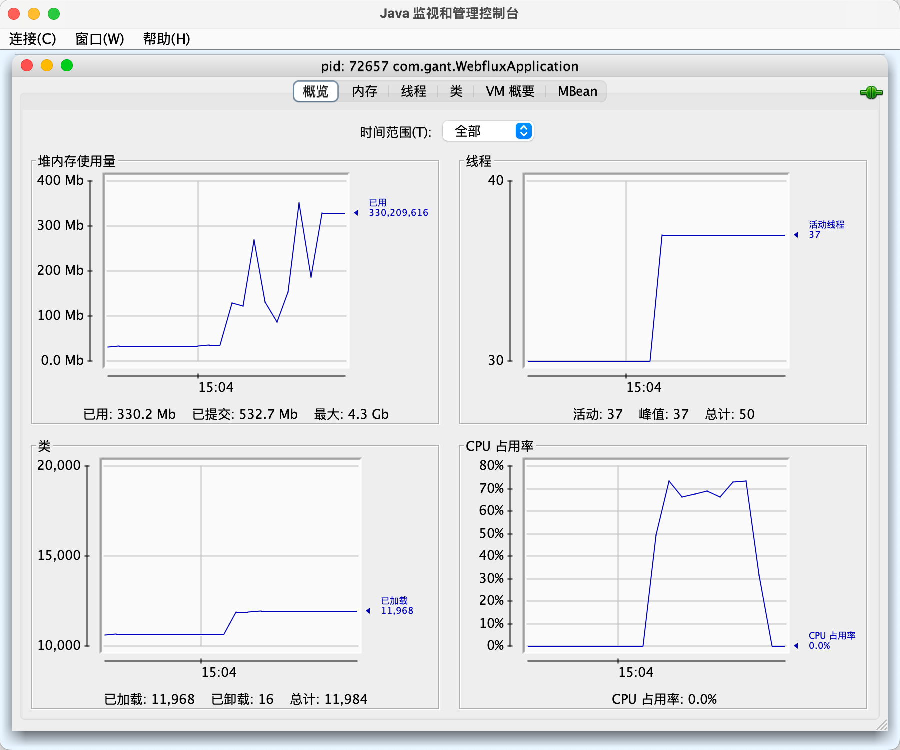

# webflux

## 一、webflux 介绍

- overview

  webflux 是 spring framework 5 引入的一种响应式编程框架，旨在为开发人员提供一种基于非阻塞、异步编程模型的方式来构建高性能的 web 应用程序。它是对传统的 springmvc 模型的一种补充，特别适合处理高并发和实时数据流的场景。

- 诞生的原因

  传统的 springmvc 是基于阻塞IO研发的，每一个请求都会分配一个线程独立处理。而对于像 netty 这种非阻塞IO的服务器支持度不够，因此需要一个非阻塞IO的 web 框架来契合 netty ，webflux 由此诞生。也因此，在springboot项目中，如果引入了webflux，则默认使用 netty 作为web服务器。

- 核心特性

  - 异步非阻塞

    允许服务器在处理 I/O 密集型任务（如数据库查询、文件读写、网络请求）时，不会因为等待这些操作完成而阻塞线程。这样可以更高效地利用系统资源，处理更多的并发请求。
  
  - 响应式编程
  
    面向数据流的编程，强调对数据流的响应。webflux基于reactor库实现，提供了Mono和Flux两种类型用于数据流的处理。Mono表示单个元素的数据流，Flux表示多个元素的数据流。通过这个特性，webflux可以对数据进行流式处理，而不必像传统springmvc那样，必须要数据完全准备好再进行批量处理。
  
    

## 二、webflux 与 springmvc 对比

- IO模型
  - springmvc采用同步阻塞式模型，每个请求都会分配一个线程
  - webflux采用异步非阻塞模型，当请求遇到IO阻塞时，线程会切换到其他请求
- 编程模型
  - springmvc采用命令式编程，需要等数据完全准备好之后再处理。
  - webflux采用响应式编程，强调对数据的流处理，数据可以在流中逐步处理。


因为以上两大特性的不同，理论上会造成如下差异：

- springmvc

  - 单个请求的耗时低

    每个请求都有单独的线程直接处理。在响应数据时，也是一次返回所有数据，不会像流处理，逐步返回数据，因此网络开销会更小

- webflux

  - 延迟低

    数据采用流式处理，不必等到所有数据都准备好才响应请求

  - 内存消耗低

    数据采用流式处理，不会在内存中存储完整的数据；采用异步非阻塞模型，不会创建大量线程


## 三、针对数据库查询场景，webflux的配套技术栈

webflux的响应式编程，强调了对数据流的响应，因此在做数据库查询时，也需要搭配同样是流式处理的技术栈，才能发挥出其特性。传统的jdbc已不满足，需要探寻新的技术栈。

- 数据库驱动：r2dbc

  r2dbc基于reactor实现，与webflux非常契合，同样支持响应式编程。

- 数据库连接池：r2dbc-pool

  r2dbc官方连接池

- orm库：mybatis-r2dbc、spring-data-r2dbc

  - mybatis-r2dbc是github上开源的库，由个人开发者维护。其整合了mybatis、r2dbc、r2dbc-pool，将mybatis底层的jdbc替换为了r2dbc，但是由于r2dbc与jdbc的api的不同，无法支持所有mybatis的特性
  - spring-data-r2dbc是spring的官方库，基于spring-data

- 响应客户端类型：text/event-stream、application/x-ndjson、application/stream+json

  - application/stream+json：json的流形式，在向客户端发送数据时，每一行发送一条json对象。spring5.3标记废弃
  - application/x-ndjson：与stream+json类似，每一行发送一条json对象。但是浏览器并不识别该类型，需要前端开发者使用Fetch搭配ReadableStream实时读取流数据，或者其他第三方库
  - text/event-stream：事件流的形式，每个事件可以传递文本（不局限json）。该类型受浏览器支持度比较高，现代浏览器一般都有EventSource组件，可以处理该类型的响应


流式处理，旨在逐步处理数据，但如果单独处理每一条数据，虽然延迟会很低，可是整体处理耗时会比较久，因此分批次处理也是不错的方案。

webflux和r2dbc都支持分批次处理。

webflux中，常用Flux来进行多数据的流式处理，它提供了buffer方法，可进行分批处理，示例如下：

```java
// io操作查询数据集合，返回flux数据流
Flux<Po> flux = mapper.findList();
// 使用buffer对数据流进行分批处理
Flux<List<Po>> buffer = flux.buffer(10);
```

r2dbc中，可通过设置驱动的fetchSize来调整批次的大小，示例如下：

```yaml
spring:
  r2dbc:
    url: r2dbc:postgresql://localhost:5432/postgres?currentSchema=public&fetchSize=1000
    username: postgres
    password: 123456
```


鉴于数据库与应用服务器一般都是内网环境，网络传输速率高，因此fetchSize设置的大一些，延迟也不会显著提高，反而会因为传输次数的降低，提升整体性能

应用服务器与客户端交互一般走公网环境，网络传输速率慢，不宜将buffer设置过高，否则会显著提升延迟，导致用户体验差


## 四、性能测试（webflux vs springmvc）

- 背景

  前文分析，理论上，webflux与springmvc会在单个请求的耗时、延迟、内存消耗方面有明显差异，因此，本文围绕这三点进行测试

- 测试指标

  - 单个请求的耗时
  - 延迟
  - 内存消耗

- 测试方案

  - 方案简述

    准备两个应用，分别使用tomcat、springmvc、jdbc与netty、webflux、r2dbc技术栈。两个应用各自实现接口，查询postgresql中的5万条数据并返回。使用jmeter负载测试工具对两个应用进行3轮请求，每轮并发100个请求，同时使用jconsole监控工具监控资源使用情况。

  - 环境说明

    - springboot版本：3.1.3
    - jdk版本：17
    - 数据库：postgresql 14

  - springmvc应用

    - 依赖：springboot、springboot-web（springmvc）、hikari、mybatis
    - 配置：数据库连接池容量100

  - webflux应用

    - 依赖：springboot、webflux、r2dbc-pool、spring-data-r2dbc
    - 配置：数据库连接池容量100、webflux批次大小100、r2dbc批次大小1000
  
- 测试结果

  - springmvc

    - 资源使用情况

      

    - 接口耗时情况
  
      

    - 接口延迟情况

      min：2911ms
  
      max：9211ms
  
      average：5698ms
  
  - webflux
  
    - 资源使用情况
  
      
  
    - 接口耗时情况
  
      
  
    - 接口延迟情况
  
      min：138ms
  
      max：459ms
  
      average：221ms
  
- 实验瑕疵

  - cpu抢占：应用与数据库都是本地部署，共用cpu资源。webflux应用对cpu的占用率更高，而且持续时间更久，会间接影响数据库性能